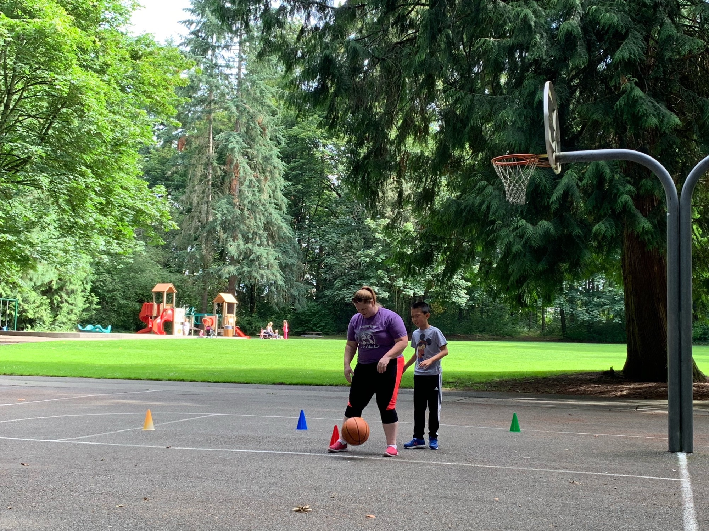
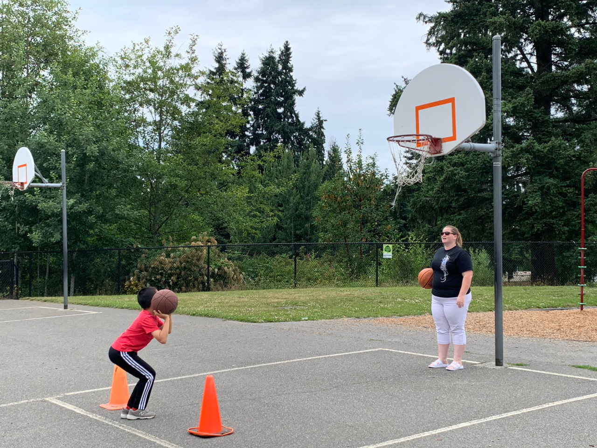

Go to [home.](../index.md)

##The trash and air joke

One day, I made a joke. It is time to clean up. 

Miss Moon: "It is time to clean up. If you haven't wiped the tables, pick ten pieces off the floor. "

Eric was pretending to pick trash ten times. He show it after. 

Miss Moon: "That is not ten pieces from the floor. "

Eric: "Yes it is. It is 10 pieces of air. "

Kayla was Laughing.

From now on, she would say "It is time to clean up. If you haven't wiped the tables, pick ten pieces of trash off the floor. ". 

#The trash and floor joke

One day, I made a joke. 

It is time to clean up. 

Miss Moon said "It is time to clean up. If you haven't wiped the tables, pick ten pieces off the floor. ".

When I was near Kayla, I said "She told us to pick 10 pieces (of/off) the floor". 

After a while, I said"That means you pick parts of the floor off and ruin the floor. "

Kayla vibrated her lips and say "what". 

##Arguing

Today, I argued @ the lock. Oops. I forgot to give imformation. 
How the lock works: 
First, a boat enters.
Then, when the water level is same, The boat exits. 
The same works the other way. 
Then I go to the park. 
I thought we are going to home!!!!!!!!!!!!!!!
I talked to dad a lot. 
Then, when I tell the truth, he start yelling!!!!!!!!!!!!!!!
Luckily, for me, gordon is "on my team". He told dad a lot. 
However, mom is "on dad's team". 

##Spencer

Spencer is a new person. Today, I am going to
 introduce him to you. Spencer ward is 26 years old and likes to ride his bike,
 read, cook food, and go camping. Spencer's mom and dad live in seattle 
and his sister lives in New York. Spencer's dad is an Oncologist and his sister is a lawyer. I like learning about Spencer. (Or do I?)

##Zombies 

This summer, I read the book named " _Here's Hank, There's a Zombie in my bathtub._ ". Hank is a boy who goes to school. Hank lives with his mom, dad, Frankie, and Emily. Hank is getting ready for Halloween and watches a scary movie about zombies. He had dreams about zombies. Hank went to the bathroom and saw a zombie. He didn't know it was Frankie dressed up like a zombie. At that time, he was shocked. At the end of the story, Hank knows that zombies don't really exist. I really enjoy the book.                     

##The Arduino mega 2560. 

The Arduino mega 2560 board is a circuit board. I'll show you how does the displays work( 1-digit and 4-digit displays). 

###1-digit display. 

So, first I am going to show you how a 1-digit display works. 

The diagram below shows you the segments and pins. 

The statements below tell you which pin means which segment. 

Pin 1 to segment E

Pin 2 to segment D

Pin 3 to GND

Pin 4 to segment C

Pin 5 to segment DP

Pin 6 to segment B

Pin 7 to segment A

Pin 8 to GND

Pin 9 to segment F

Pin 10 to segment G

Click or press [here](https://www.instructables.com/id/Arduino-7-Segment-Display-Counter/) for more.

###4-digit display. 

Now, I am going to teach you about the 4-digit display. 

The 4-digit display is like the 1-digit display but is different in some ways. 

The diagram below shows the pins on the common-cathode type. Note that segment A is connected to everything. 

Since it's common-cathode, the pins 1, 2, 3, 4, d1, d2, d3, and d4 is a cathode(-). 
Even though A (and all other segments )is a connected segment, it is still possible to display 4 different stuff, like 1234. 
Click or press [here](http://haneefputtur.com/7-segment-4-digit-led-display-sma420564-using-arduino.html) for more.

##8/8/2019 Gasoline gas and I DID IT!!!!!!!!!

Today, I am going to give the car gas. 

First, I open the lid...cap...I'm not sure. Then, I select the grade 87( regular) and I put the thing in. 

Then, after a while, It goes POP and I take the heavy thing out. 

##The zombies2

The book was awesome." Hank isn't reading the 'not'". I think my whole school will like it. 
    Well, it's just the students and teachers. A school can't read. 
I want another book. 

##8/4/2019 The weird story of the crystal adventure. 

Today is crystal day. I drove all the way there. 
    But not really, because I am not over 16.If you look at home, you can see that I am 9, not any number over (or at )16. 
Then we go mountain climbing.
    But not really, because mountains can't climb mountains. That would be weird. Mountains don't have legs. 

Then, I mine with a knife. A butter knife. 
    But not really, because I can't get out rock with the knife. That would be weird and dangerous. 
Next, we go for the crystals. 
    But not really, because we don't dig all crystals. It will be long. 
We got some crystals. We mountain climb back down. 
    But not really, because mountains can't climb mountains. That would be weird. I thought we talked about it before the images. 
Then my dad drove to the bridge with me. I see some more crystals. 

After that, at home, my dad clean a crystal by water. 

I love the adventure. 

##8/3/2019 Special Social

I went to a new building. I played mouse trap, and circuit maze with my (new) friends. I also shared out cupcakes. I even saw the mistaken sentence. I had lo~~ooooooooo~~ts of fun

###How to play:

####Mouse trap

You set up the traps. players take turns rolling the dice. if you land on a red, you lose a cheese. if you land on a yellow, take a cheese. if you land on a green, you steal a cheese. if you land on a blue, you can trap someone and steal their cheese( if they have cheese). if you land on a purple, do nothing. 

####Circuit maze

Complete the circuit to light the beacons and you win!

##The Great Yellowstone Scavenger Hunt

I went on a great Yellowstone scavenger hunt vacation. I went with my family. We got there by car. It was fun. I saw many animals. I say bison, gray wolf, black bear, the grizzly bear, and some deer. I visited lots of places in the park: Steamboat geyser, Mineral terrance, Old Faithful, and Artist's Paint Pot. I also saw Mammoth Hot Springs. I like my Great Yellowstone Scavenger Hunt.                                                                   

##7/29/2019 basket ball

Today my brother, Gordon, is my coach. we go to Nike park. 

We warm up by shooting to the hoop. 
Then, I dribble. 

then, I shoot at the line

Then, I try stealing my brothers ball. 
    But not really, or I am mean. 
And he sometimes try to steal my ball. 
    But not really, or he is mean.
Next, I zig-zag to the cones.
    But not really, because I am going from one to the other. 
Next, we have a game. 
Whoever gets his/her opponent's ball out of
 a area win's!
I play with Cindy and Gordon. 
Mom says me and Gordon can get some ice cream!

##7/28/2019 bike ride. 

I was going on bike when I finish Dinner. I am now at bike park.
I go on straight. I go on a trail called "Don't stop, won't stop" and "Easy A"
. I can show you. 

##Emotions helper (out of the red Zone).
 

Today, I was angry at mom! I have a HUGE ARGUMENT with mom. 
When I got there, my mom is faster than me like I am a turtle and she is a hare. 
My mom pushed me to walk fast. 

                                                                                                                                                                                                                                                                                                                     

Eric said "I can't! "

Mom said "Then run. "

Eric said "I am not in the mood"

Mom said that I am selfish because I use my mood. 

I thought she was selfish because she used her (hurrying )mood.

At the pool, I and lauren work together to make a paper of calm. 

.png)

When I came back from pool, I was calm from the calm pool with a calm sheet of
paper in my calm hand and a calm person named Lauren. Lauren made a chart about my angry emotions.
here are the triggers:

And here is how I calm down:

.png)

## Yellowstone national park

Soon, I am going to Yellowstone National park with my family. We are going to drive there. It will be a long drive. We might stop along the way and stay in a hotel. The truth is I don't really know so much about yellowstone, but I'm going to learn when I go there.                                                                                      

## 7/14/2019 Turning tumble

Today, I am going to teach you a game called Turning Tumble. It is a marble-powered computer. I like it. 

1. Each challenge has an object. You must create a machine to do the object. 
2. To start a machine, You must press the start button once. 
3. Once the machine is in motion, you cannot touch the machine or otherwise interfere with it's operator
4. Your machine cannot let balls drop freely for any distance. See the example above. 
5. Challenges start easy, but they become exceedingly difficult, even for a seasoned deep space telecommunications engineer. 

    If you get stuck, take a break and come back to the puzzle later. 

-------------------------------------------------------------------

### Example:

1. set up it matching, decorations and/or parts may vary. 

2.Set up your solution. The lines is the path. 

3.test it. press the "press to start" button. 

### The parts:

Ramp: ball goes out a side depending on which way it face*.
Crossover: ball enters one side and out the other. 
Bit: ball goes out one side and then changes the direction it points depending which direction it is pointing before*. 
Interceptor( not shown): stops the marble computer from running. 
Gear bit: gear bits flip each other. If only 2 gear bits are connected together, put high-function washers behind each of them to make them run smoothly*. 

*Animation included in the part when touched by ball. 

## 7/13/2019

Today is the last social day. I met Liam, Siddhartha, And Matene. 
When I arrived, I give flowers to Michele. She felt happy. she thank me!

Then, we play in the gym. 
We played play-dough. During play-dough, we talked about the unthinkable. 
    
    Mu unthinkable team:
    Leader: Glassman
    stratagy: Deep breath
    Time: He is taking over the world
    #2: Brain eater
    Stratagy: stop playing
    time: When momy wants me to stop
    #3: Wasfunonce(was-fun-once)
    Stratagy: stop it. 

After we pack up, we got popsicles. We all got orange flavor. 
It's good and yummy. 

##7/12/2019

Today is Basketball day. I met Melinda. 
First, we go to Nike park. 
We played around the world. 
1. Melinda draw the numbers  1-6.
2. We start at number 1. 
3. First, I shoot at the hoop.
4. Then, Melinda shoot at the hoop.
5. If someone shoot it in, their number goes to 2,3,4, and so on. 
6. The first person to get to 6, wins.

Next, we play Layup( not really a game).

Then, we move the cones anywhere we want. We try not to knock down the cones. 
After that, I try to steal Melinda's ball. 
When I have the ball, Melinda try to steal my ball

Then we played Around the world. Melinda won. 
Then we played Follow the line. 
At last we played Cup stacking at home. 

##7/12/2019

Today is Basketball day. I met Melinda. 
I was at a basketball court in my school. 
Melinda and I start out by letting me try to make it in. I start a little of the line near the hoop. 

Then, I go to the left of the hoop. it is on point 1. 

Then, I go to the right of the hoop. it is on point 5. 
After that, I go around a circle.

Then, I show of my dribbling skills. 

After that, I try to steal Melinda's ball. 
When I have the ball, Melinda try to steal my ball

After that, I  try to win poison
but I lost 1 time. 

1. All players stand in a line.
2. The first person shoots the ball in the hoop.
3. If he/she made it, the person runs to the pole.
4. Then the person touches his ball on the pole and says "poison".
5. The second person can't move. The first person roll it to the second person. 
6. If he/she hit the second person, then the first person won. 
7. If the first person miss the second person, or didn't made the ball in the hoop, The second person shoots. 

Then, I practice dribbling. 

##7/10/2019 social in the pool:)

Today is social pool day. I met Lauren and Sammy. 

First, we played basketball. 
We set the basketball hoop up in the pool. 
I went first. Lauren made me throw far. I mostly threw the ball in the hoop. Then, Sammy threw the ball to the hoop. 
The game was fun. 

I also saw Anthony at the pool. Then, we played Tic Tac Toe. 
I set a board and the Tic-Tac-Toe cross on the edge of the pool. 
We split into 2 teams. 
One person runs to the Tic-Tac-Toe cross. 
Then he/she places their choice, then run back. 
I lose. ):
After the game, we went to Sammy's pretend cupcake store. 
We ate a cupcake, then a cupcake grow out of our skins! 
Then I need to go. That is my fun hour. 
Bye. See you soon! :D

## 7/9/2019 social in the park(dream BIG)

Today is social park day. I met Lauren, Adith, and Kanyi.

 
First, I listened to a story. It was about going to Mars. 
Then we played running Tic Tac Toe.
1. we set it up with sticks, beanbags, and toy monkeys.
2. We separate into 2 groups. 
3. We take turns, try to get 3 in a row.
4. I run, place my item, run, and then tag my partner.

I won 4 times. I love the game and I wish I can play again. 

I also played on the igloo and the rest of the playground. 

Today, I have lots of fun. I want to go there again. 

Today, I also have a BIG dream of saving animals. I am proud of myself. 
Mom is also proud of me. 

## 7/8/2019

Today I learned Chinese , "How to introduce Yourself". I am here to show you.
你好
Nǐ hǎo
That means hello. You normally greet with 
Nǐ hǎo
 to normal china people.
 
### Introduce(1)

我姓(last name)
This can be translated as "My last name (is)"
If I introduce, I may say"
你好
(Nǐ hǎo)
我姓王
(Wǒ xìng wàng)"

### Introduce(2)

I can also translate using 我叫(first name, nickname, or full name)
(Wǒ jiào)This is translated as "My name is".
 Tip:
 If your first name have 1(not 2) caracters, you can only use full name or nickname.
My full (Chinese )name is wangruihan
(王瑞涵)I may say 
"Nihaw wojiaowangruihan。"

So zaijian(bye) (user's Chinese name), see you next time.

## 7/7/2019 Big Fore Ice Caves

I went to the Big 4 Is Ice Cave today.
 
I went all the way there and it was a long trip.
When I got there, I saw Big 4 Ice Cave.
The cave looked big and around.
It looked I could go through it. 
When I walked closer, I felt cold and all water dropped down like raindrops.
Then I climbed the huge rock and mum took photos for me. 
Before go home, I found a special rock like cheese.
I pretended to eat it.
 
I really like that whole trip.

## 7/6/2019 LEGO Game - Don't Topple The Tower(s)

### Rules for the game

Build the game as shown( some pieces are hiding and/or aren't in your
 lego collection). To play, put 5 marbles, one at a time, on the clear 
plastic. Here is the clearer version of the score:

    0 2 4 6 (-1 if toppled)
    1 2 3 4
    1 2 3 4
    0 2 4 6 (-1 if toppled)
When all the marbles are done, record your score on using the chart. 
Here is a clearer version of the score sheet for a player:

    ()+()+()+()+()-()-()=()
    marbles        t- b-
    remark:t- = 1 if upper tower toppled,
    b- = 1 if top lower toppled.

## 7/6/2019 Run in the morning

It is a sunny and warm day. I ran with my dad(Denny) in the morning.:)

I did warmups. I did that first.

I start at my home. I run with a app called RUNKEPPER. I really am walking, 
not running, because I was tired. 
We walk and walk all the way to Powerline Trail. 
I ran on downhills. The first thing I saw is a daisy( I guess).(:

 

I ran so fast I felt uncomfortable  one downhill with wooden sticks.
I jumped perfectly over the wood. I even saw a dandelion(cool?).

I also saw, stop, and take photo of a pink flower (and trail )(as shown ).

We went into a small passage that led me to home. But on
 our way home, I picked an apple (that I think is raw ). See below for
 a picture. 

(i'sn it cool I found one?)

I also see a pear(. Wow).

    
    Did you know:
        I even saw a bird 
    

I love running (I mean walking )on a trail( with my dad).

## 7/4/2019 and 7/5/2019 Olympia National Park

### 7/4/2019

Today I had a day at a hotel. My parents drove for more than 
100 miles!I went to mcdonald 2 times. At the hotel, I sleep.
 My dream is a teacher teaching me solutions to unknown puzzles.
 I wrote them down.
 
### 7/5/2019

 I see paw patrol. I went to ruby beach. Then home.
 
 
 Trip ended. But I will go to yellowstone...
 
 (:
 
    Did you know:
    On Independence day(7/4/2019), I see more 
    then 200 fireworks!I even saw a capital
    buiding!
 
 
 
 Thanks to Gordon, we went to the trip.

 

  

I even saw

## 06/28/2019 Amazon Day

Today I went to amazon. I will tell you this is what I went to:

1. Buid your own brand, But toooo many people
2. Denny park( My dad?)
3. Build alexa( work on my echo) skill. the stuff work. I 
tried the question and got the right answer. After I back home
, I asked "alexa, Best mom. She answered, "I compare the 
ones in the history and my conclution is the best one is
 Cindy.". Also, I made a story skill called beach adventure.
  If you would like to try, ask me and I can share it with
   you.
4. BIGFOOT(lunch)

5. Houdini south(coding)
6. The spheres(free-play on grenier cities). I built Amazon 
campus here. See picture below.
    

Go to [home](../index.md) using this shortcut. 