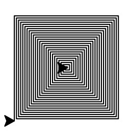

[Home](../index.md)

Hi, here is python.
All projects are on here\

    I mean here.
    
So, Lets start.
##Turtle graphics.1.1
###Spirals

Spirals are basics for turtle graphics.
Here is a code:

```python
import turtle

t = turtle.Pen()
for x in range(100):
    t.forward(x)
    t.left(90)
turtle.getscreen().getcanvas().postscript(file='outputname.ps')

turtle.done()
```

1. we import( or install) turtle graphics. 
2. shortcuts turtle.Pen to t. 
3. is a loop for later. 
4.  


