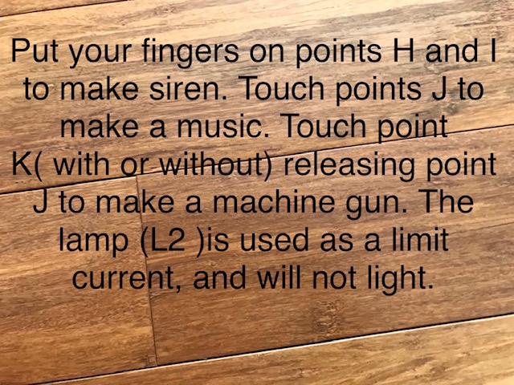
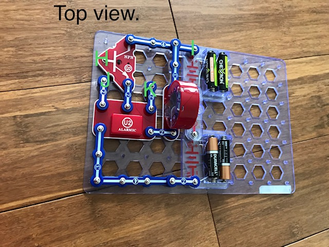
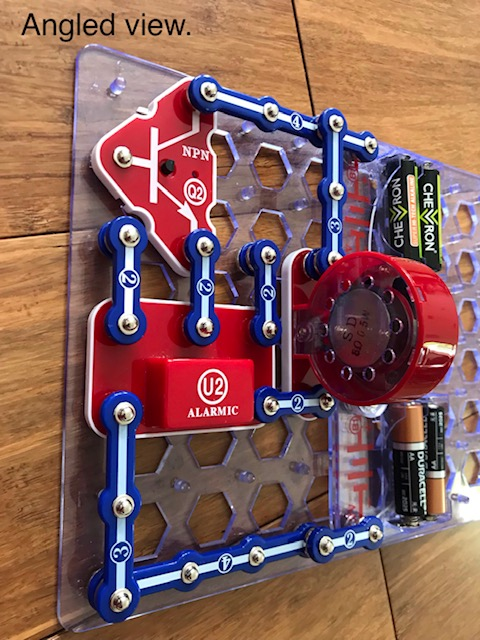

[Home](../index.md) -> [Snap Circuits](index.md)

## How is it looks like

This circuit will only work when you use your body as part of it.

This shows how it work.

Have a look at top view. Here are the points. 

Have a look at angled view. There are spacers.

## The parts
### The Alarm IC
At the alarm IC. The part has 5 areas.

in1  in2  in3

 -.  U2 Ic  out.
 
 
 1.The inputs(in1 in2 in3)make noise
 
 2.The out is connected to the speaker and the +.
 
 3.The -. stands for "connected to return power.".
 
### Q2 
 
 The Q2 is the one that makes your body a part. 
 
 Parts:
 
       C Collector
    
    O Operator
 
       A All power out
    
 At C, we collect power.
 
 A small current at O makes a large current at A.
 
      